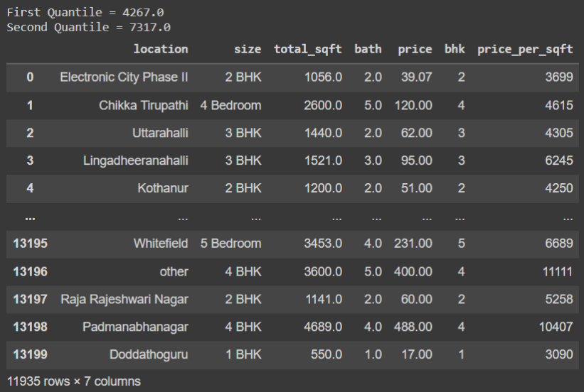

# Ex02-Outlier

#  AIM :
You are given bhp.csv which contains property prices in the city of banglore, India. You need to examine price_per_sqft column and do following,

(1) Remove outliers using IQR

(2) After removing outliers in step 1, you get a new dataframe.

(3) use zscore of 3 to remove outliers. This is quite similar to IQR and you will get exact same result

(4) for the data set height_weight.csv find the following
```
(i) Using IQR detect weight outliers and print them

(ii) Using IQR, detect height outliers and print them
```
# EXPLANATION :
Outlier is a data object that deviates significantly from the rest of the data objects and behaves in a different manner. They can be caused by measurement or execution errors. The analysis of outlier data is referred to as outlier analysis or outlier mining. The box plot is a useful graphical display for describing the behavior of the data in the middle as well as at the ends of the distributions. The box plot uses the median and the lower and upper quartiles (defined as the 25th and 75th percentiles). If the lower quartile is Q1 and the upper quartile is Q3, then the difference (Q3 - Q1) is called the interquartile range or IQ.

# ALGORITHM :
## Step 1:
Import the required packages(pandas,numpy,scipy)

## Step 2
Read the given csv file.

## Step 3
Convert the file into a dataframe and get information of the data.

## Step 4
Remove the non numerical data columns using drop() method.

## Step 5
Detect the outliers in the data set using z scores method.

## Step 6
Remove the outliers by z scores and list manupilation or by using Interquartile Range(IQR)

## Step 7
Check if the outliersare removed from data set using graphical methods.

## Step 8
Save the final data set into the file.

# CODE:
## 1) & (2) Examine price_per_sqft column and use IQR to remove outliers and create new dataframe

```
Developed by: KRISHNA PRAKAASH D M
Register number:212221230052

import pandas as pd
import numpy as np
import seaborn as sns

df = pd.read_csv("/content/drive/MyDrive/Colab Notebooks/Semester 3/19AI403 - Data Science/bhp.csv")
df

df.head()

df.describe()

df.info()

df.isnull().sum()

df.shape

sns.boxplot(x="price_per_sqft",data=df)

q1 = df['price_per_sqft'].quantile(0.25)
q3 = df['price_Aper_sqft'].quantile(0.75)
print("First Quantile =",q1,"\nSecond Quantile =",q3)

IQR = q3-q1
ul = q3+1.5*IQR
ll = q1-1.5*IQR

df1 =df[((df['price_per_sqft']>=ll)&(df['price_per_sqft']<=ul))]
df1

df1.shape

sns.boxplot(x="price_per_sqft",data=df1)
```
## (3)Examine price_per_sqft column and use zscore of 3 to remove outliers.
```
from scipy import stats
z = np.abs(stats.zscore(df['price_per_sqft']))
df2 = df[(z<3)]
df2

print(df2.shape)
sns.boxplot(x="price_per_sqft",data=df2)
```
## (4)(i) For the data set height_weight.csv detect weight outliers using IQR method
```
df3 = pd.read_csv("/content/drive/MyDrive/Colab Notebooks/Semester 3/19AI403 - Data Science/height_weight.csv")
df3

df3.head()

df3.info()

df3.describe()

df3.isnull().sum()

df3.shape
````
```
sns.boxplot(x="weight",data=df3)

q1 = df3['weight'].quantile(0.25)
q3 = df3['weight'].quantile(0.75)
print("First Quantile =",q1,"\nSecond Quantile =",q3)

IQR = q3-q1
ul = q3+1.5*IQR
ll = q1-1.5*IQR

df4 =df3[((df3['weight']>=ll)&(df3['weight']<=ul))]
df4

df4.shape

sns.boxplot(x="weight",data=df4)
```

## (4)(ii) For the data set height_weight.csv detect height outliers using IQR method.
```

sns.boxplot(x="height",data=df3)
q1 = df3['height'].quantile(0.25)
q3 = df3['height'].quantile(0.75)
print("First Quantile =",q1,"\nSecond Quantile =",q3)

IQR = q3-q1
ul = q3+1.5*IQR
ll = q1-1.5*IQR

df5 =df3[((df3['height']>=ll)&(df3['height']<=ul))]
df5

df5.shape

sns.boxplot(x="height",data=df5)
```

# OUTPUT:
## (1)(2) Examine price_per_sqft column and use IQR to remove outliers and create new dataframe.

###  Dataset


### Dataset Head :


### Dataset Info :


### Dataset Describe:


### Null Values


### Dataset Shape


### Box plot of price_per_sqft column with outliers


### price_per_sqft - Dataset after removing outliers


### price_per_sqft - Shape of Dataset after removing outliers :


### Box Plot of price_per_sqft column without outliers


## (3) Examine price_per_sqft column and use zscore of 3 to remove outliers.
## Dataset after removal of outlier using z score


## Shape of Dataset after removal of outlier using z score


## price_per_sqft column after removing outliers


# (4) For the data set height_weight.csv detect weight and height outliers using IQR method:

### Dataset:


### Dataset Head:


### Dataset Info:


### Dataset Describe


### Null Values:


### Dataset Shape:


### Weight - With outliers


### Weight - Dataset after removing Outliers using IQR method


### Weight - Shape of Dataset after removing Outliers using IQR method


### Weight - Without Outliers using IQR method


### Height - With outliers


### Height - Dataset after removing Outliers using IQR method


### Height - Shape of Dataset after removing Outliers using IQR method


### Height - Without Outliers using IQR method


# RESULT:
The given datasets are read and outliers are detected and are removed using IQR and z-score methods.

